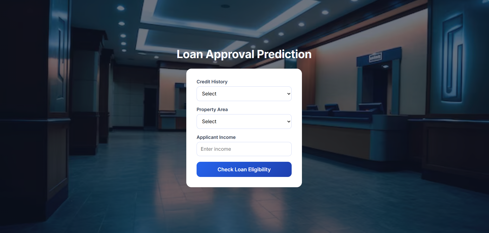
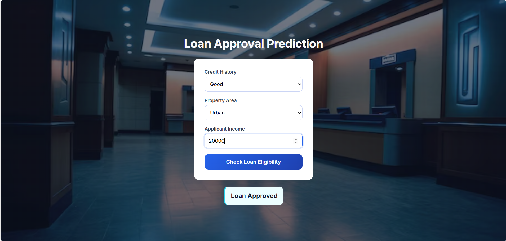

# Loan Approval Prediction System

A machine learning–powered web application that predicts whether a loan application will be **approved or rejected** based on applicant information such as credit history, property area, and income.
The project covers the **complete ML lifecycle** — from data analysis and model training to deployment using **Flask**.

---

## Project Overview

Loan approval is a critical and sensitive process for financial institutions. Traditional manual evaluation is time-consuming and can lead to inconsistencies and delays.

This project automates loan eligibility prediction using machine learning, enabling **faster, consistent, and data-driven decisions**.
Users can enter applicant details through a web interface and instantly receive a loan approval decision.

---

## Business Problem & Context

**Problem**

* Manual loan approval is slow and error-prone
* High operational workload for loan officers
* Delayed decisions reduce customer satisfaction

**Opportunity**

* Machine learning can assist or automate decision-making
* Faster approvals improve customer experience
* Institutions benefit from operational efficiency

This system demonstrates how predictive modeling can support real-world financial decision processes .

---

## Solution Goals

* Predict loan approval status accurately
* Reduce manual effort in loan evaluation
* Provide quick and consistent decisions
* Demonstrate end-to-end ML deployment

---

## Stakeholders

* **Loan Officers** – Use predictions as decision support
* **Management** – Improve efficiency and cost control
* **Customers** – Receive faster and transparent outcomes

---

## Machine Learning Pipeline

1. **Data Collection**

   * Dataset sourced from `Loan_Data.csv`

2. **Data Preprocessing**

   * Missing value handling
   * Encoding categorical variables
   * Feature selection

3. **Model Training & Evaluation**

   * Multiple algorithms evaluated:

     * Logistic Regression
     * Decision Tree
     * SVM
     * Random Forest
     * AdaBoost
     * Gradient Boosting
     * XGBoost
   * Best-performing model selected based on accuracy and F1-score 

4. **Model Serialization**

   * Final model saved as `ab_best_model.pkl`

5. **Deployment**

   * Flask backend for predictions
   * HTML & CSS frontend for user interaction

---

## Tech Stack

* **Language:** Python
* **Libraries:** NumPy, Pandas, scikit-learn
* **Web Framework:** Flask
* **Frontend:** HTML, CSS
* **Model Storage:** Pickle

---

## Project Structure

```
loan-approval-prediction/
│
├── notebooks/
│   └── loan_prediction_project.ipynb
│
├── templates/
│   └── index.html
│
├── static/
│   └── styles.css
│
├── screenshots/
│   ├── home.png
│   ├── approved_result.gif
│   └── rejected_result.gif
│
├── ab_best_model.pkl
├── app.py
├── Loan_Data.csv
└── requirements.txt
```

---

## Web Application Preview

### Home Page



### Loan Approved



---

## How to Run the Project Locally

### Clone the repository

```bash
git clone https://github.com/armaan-pathan/loan-approval-prediction.git
cd loan-approval-prediction
```

### Install dependencies

```bash
pip install -r requirements.txt
```

### Run Flask application

```bash
python app.py
```

### Open in browser

```
http://127.0.0.1:5000/
```

---

## Input Features

| Feature          | Description               |
| ---------------- | ------------------------- |
| Credit History   | Good (1) / Bad (0)        |
| Property Area    | Rural / Urban / Semiurban |
| Applicant Income | Applicant’s income amount |

---

## Output

* **Loan Approved**
* **Loan Rejected**

The prediction result is displayed instantly on the UI.

---

## Future Enhancements

* Add more applicant features (loan amount, dependents, employment)
* Improve model performance with feature engineering
* Show approval probability score
* Deploy on cloud platforms (AWS / Render / Railway)
* Add user authentication and logging

---
=======
# loan-approval-prediction-analysis
An end-to-end machine learning web application that predicts loan approval based on applicant details, featuring a modern UI, data preprocessing, model training, and Flask-based deployment.

